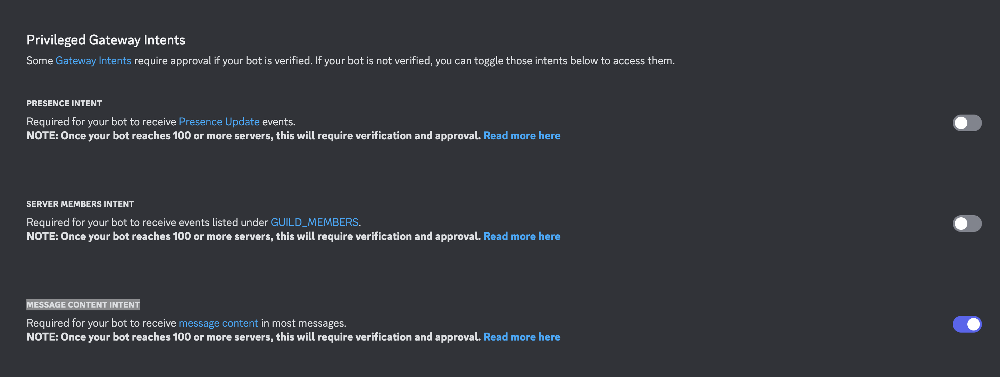

# Discord Bot

https://discord.com/developers/applications/1378387843482652702

Need to give permissions to read / write etc via OAuth2 Section and Message Content Intent

# Python Commands

```bash
# Start environment
python3 -m venv .venv

# Activate it
source .venv/bin/activate

# Install requirements
pip install -r requirements.txt

# Save new requirements
pip freeze > requirements.txt
```

# Examples



